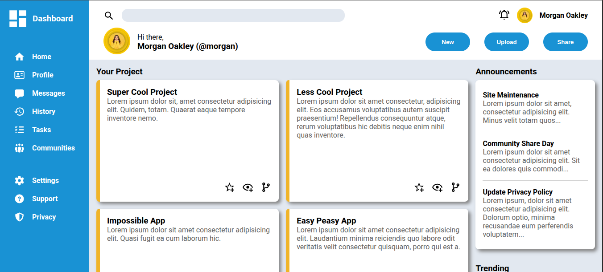

# top-admin-dashboard

Dashboard Layout

This project is a simple dashboard layout built with HTML & CSS Grid/Flexbox.
It demonstrates structuring a responsive admin-style interface with a sidebar, header, projects section, announcements, and trending user cards.

🚀 Features

Responsive grid layout using CSS Grid.

Sidebar navigation with icons and menu items.

Header section with search bar, notifications, and user profile.

Project cards arranged in a flexible grid.

Announcements & trending section styled with card components.

Custom button styling with hover effects.

Roboto font family for clean typography.

📂 Project Structure
.
├── index.html # Main HTML file
├── assets/css/style.css # CSS styling
├── assets/js/script.js # js for future use
└── assets/images/icons

🛠️ Technologies Used

HTML5

CSS3

Flexbox

CSS Grid

Box Shadows

Border Radius

📸 Layout Overview

Sidebar → Contains dashboard title and navigation menu.

Header → Includes search bar, notifications, and profile.

Main section → Projects grid, announcements, and trending users.

⚙️ How to Run

Clone this repository:

git clone https://github.com/fanuelH/top-admin-dashboard.git

Open index.html in your browser.

(Optional) Use VS Code Live Server for hot reloading.

✨ Future Improvements

Make sidebar collapsible (hamburger menu).

Add interactivity with JavaScript.

Improve responsiveness on smaller devices.
